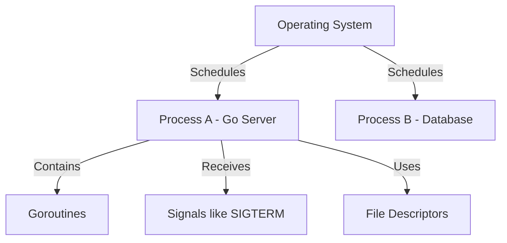

# HC.5 How the OS Manages Processes

## Mission
Understand that your Go program runs inside an OS process, interacting with the system through signals, file descriptors, and isolated memory.

## Prerequisites
- `HC.4` Terminal Confidence

## Mental Model
A process is a sandbox given to your program by the OS. It has its own private memory (virtual memory), its own file descriptors (ways to talk to the outside world), and it can receive messages (signals) from the OS.

## Visual Model


## Machine View
The OS translates virtual memory addresses to physical memory, ensuring processes cannot corrupt each other. It uses preemptive multitasking to share CPU cores. It communicates with processes using signals (e.g., SIGTERM to shut down, SIGINT for Ctrl+C).

## Run Instructions
```bash
go run ./00-how-computers-work/5-os-processes
```

## Code Walkthrough
In `main.go`, we print the Process ID (PID) of the current program. This demonstrates that the Go runtime is just executing within a standard OS process.

## Try It
1. Run the program and note the PID it prints.
2. In another terminal, try to find that process using `ps aux | grep <PID>` (you have to be quick!).

## ⚠️ In Production
**Your deployed Go service is a process.** When Kubernetes wants to restart your service, it sends `SIGTERM`. If your service doesn't gracefully shut down within the timeout, it gets `SIGKILL` — which can corrupt in-flight requests. File descriptor limits (e.g., too many open network connections) can also crash production servers.

## 🤔 Thinking Questions
1. Your Go HTTP server receives `SIGKILL` in the middle of processing a payment. The money was debited but the order wasn't created. What's the consequence? How might you design against this?
2. Every goroutine has its own stack but shares the heap. What does this mean for data safety? What kinds of bugs become possible?
3. If the OS can preempt your process at any time (even in the middle of a statement), what implications does this have for concurrent code that modifies shared data?

## Next Step
[GT.1 Installation](../../01-getting-started/1-installation)
